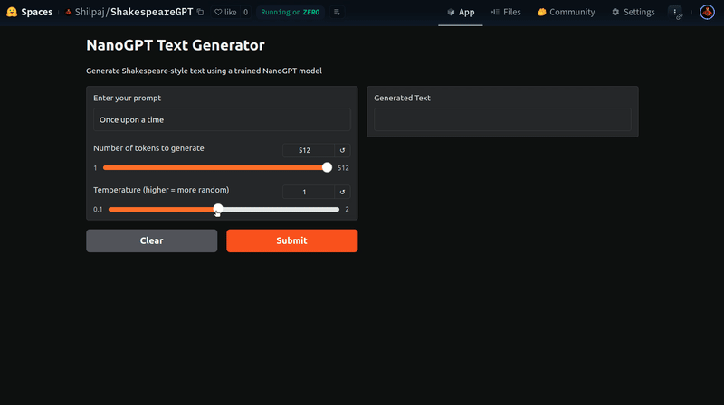

# Pre-Training

This section focuses on Embeddings and Pre-training.


In this project, a GPT (decoder-only) model is trained on Shakespeare data. The model architecture follows the original GPT design with multi-head self-attention and feed-forward layers. Key specifications include:

- 12 transformer layers
- 12 attention heads 
- 768 embedding dimensions
- 1024 context window size
- ~50k vocabulary size

The model is trained using cross-entropy loss and AdamW optimizer with weight decay. Training is done on Shakespeare's works to learn the language patterns and writing style. The trained model can generate Shakespeare-style text given a prompt.


### Project Structure

```bash
.
├── assets              # Images for README
├── nano_gpt_model.pt   # Trained model
├── GPT124M.ipynb       # Notebook for training
├── input.txt           # Shakespeare data
├── README.md           # This file
└── requirements.txt    # Dependencies
```


### Install Dependencies

```bash
pip install -r requirements.txt
```


### Run the Notebook

```bash
jupyter notebook GPT124M.ipynb
```


### Training Logs

Training logs for few steps are shown below:

```bash
Total model parameters: 124,439,808

loaded 338025 tokens
1 epoch = 82 batches
GPU Memory: 3.75GB / 12.74GB
step 100 | loss: 5.6404
    
GPU Memory: 3.75GB / 12.74GB
step 200 | loss: 5.5134
    
GPU Memory: 3.75GB / 12.74GB
step 300 | loss: 5.3910
    
GPU Memory: 3.75GB / 12.74GB
step 400 | loss: 5.2524
    
GPU Memory: 3.75GB / 12.74GB
step 500 | loss: 4.6032
    
GPU Memory: 3.75GB / 12.74GB
step 600 | loss: 4.9332
    
GPU Memory: 3.75GB / 12.74GB
step 700 | loss: 4.6553
    
GPU Memory: 3.75GB / 12.74GB
step 800 | loss: 4.7186
    
GPU Memory: 2.92GB / 12.74GB
step 900 | loss: 4.1250
    
GPU Memory: 3.75GB / 12.74GB
step 1,000 | loss: 4.4559
    
GPU Memory: 3.75GB / 12.74GB
step 1,100 | loss: 4.5999
    
GPU Memory: 2.92GB / 12.74GB
step 1,200 | loss: 4.1833
    
GPU Memory: 3.75GB / 12.74GB
step 1,300 | loss: 3.9645
    
GPU Memory: 3.75GB / 12.74GB
step 1,400 | loss: 3.8615
    
GPU Memory: 2.92GB / 12.74GB
step 1,500 | loss: 4.2542
    
GPU Memory: 3.75GB / 12.74GB
step 1,600 | loss: 4.2003
    
GPU Memory: 3.75GB / 12.74GB
step 1,700 | loss: 4.0364
    
GPU Memory: 3.75GB / 12.74GB
step 1,800 | loss: 3.5748
    
GPU Memory: 2.92GB / 12.74GB
step 1,900 | loss: 3.8551
    
GPU Memory: 3.75GB / 12.74GB
step 2,000 | loss: 3.6285
    
GPU Memory: 3.75GB / 12.74GB
step 2,100 | loss: 3.6612
    
GPU Memory: 3.75GB / 12.74GB
step 2,200 | loss: 3.5561
    
GPU Memory: 3.75GB / 12.74GB
step 2,300 | loss: 3.6639
    
GPU Memory: 3.75GB / 12.74GB
step 2,400 | loss: 3.2081
    
GPU Memory: 3.75GB / 12.74GB
step 2,500 | loss: 3.3870
    
GPU Memory: 3.75GB / 12.74GB
step 2,600 | loss: 3.5052
    
GPU Memory: 3.75GB / 12.74GB
step 2,700 | loss: 3.1396
    
GPU Memory: 3.75GB / 12.74GB
step 2,800 | loss: 3.2755
    
GPU Memory: 3.75GB / 12.74GB
step 2,900 | loss: 3.1607
    
GPU Memory: 2.92GB / 12.74GB
step 3,000 | loss: 2.9122
    
GPU Memory: 3.75GB / 12.74GB
step 3,100 | loss: 2.9336
    
GPU Memory: 3.75GB / 12.74GB
step 3,200 | loss: 2.9337
    
GPU Memory: 3.75GB / 12.74GB
step 3,300 | loss: 2.6723
    
GPU Memory: 3.75GB / 12.74GB
step 3,400 | loss: 2.7260
    
GPU Memory: 2.92GB / 12.74GB
step 3,500 | loss: 2.9506
    
GPU Memory: 3.75GB / 12.74GB
step 3,600 | loss: 2.5892
    
GPU Memory: 3.75GB / 12.74GB
step 3,700 | loss: 2.6180
    
GPU Memory: 3.75GB / 12.74GB
step 3,800 | loss: 2.6281
    
GPU Memory: 3.75GB / 12.74GB
step 3,900 | loss: 2.5213
    
GPU Memory: 3.75GB / 12.74GB
step 4,000 | loss: 2.1585
    
GPU Memory: 3.75GB / 12.74GB
step 4,100 | loss: 2.2888
    
GPU Memory: 3.75GB / 12.74GB
step 4,200 | loss: 2.1620
    
GPU Memory: 3.75GB / 12.74GB
step 4,300 | loss: 2.1423
    
GPU Memory: 3.75GB / 12.74GB
step 4,400 | loss: 2.1547
    
GPU Memory: 3.75GB / 12.74GB
step 4,500 | loss: 2.1725
    
GPU Memory: 3.75GB / 12.74GB
step 4,600 | loss: 1.8683
    
GPU Memory: 3.75GB / 12.74GB
step 4,700 | loss: 2.0018
    
GPU Memory: 3.75GB / 12.74GB
step 4,800 | loss: 1.9190
    
GPU Memory: 3.75GB / 12.74GB
step 4,900 | loss: 1.8945
    
GPU Memory: 3.75GB / 12.74GB
step 5,000 | loss: 1.5110
    
GPU Memory: 3.75GB / 12.74GB
step 5,100 | loss: 1.7640
    
GPU Memory: 3.75GB / 12.74GB
step 5,200 | loss: 1.6642
    
GPU Memory: 3.75GB / 12.74GB
step 5,300 | loss: 1.4798
    
GPU Memory: 3.75GB / 12.74GB
step 5,400 | loss: 1.3588
    
GPU Memory: 3.75GB / 12.74GB
step 5,500 | loss: 1.3964
    
GPU Memory: 3.75GB / 12.74GB
step 5,600 | loss: 1.4300
    
GPU Memory: 3.75GB / 12.74GB
step 5,700 | loss: 1.2615
    
GPU Memory: 3.75GB / 12.74GB
step 5,800 | loss: 1.1194
    
GPU Memory: 3.75GB / 12.74GB
step 5,900 | loss: 1.0589
    
GPU Memory: 3.75GB / 12.74GB
step 6,000 | loss: 1.1983
    
GPU Memory: 3.75GB / 12.74GB
step 6,100 | loss: 1.0443
    
GPU Memory: 3.75GB / 12.74GB
step 6,200 | loss: 0.9556
    
GPU Memory: 3.75GB / 12.74GB
step 6,300 | loss: 0.8669
    
GPU Memory: 3.75GB / 12.74GB
step 6,400 | loss: 0.8857
    
GPU Memory: 3.75GB / 12.74GB
step 6,500 | loss: 0.7104
    
GPU Memory: 2.92GB / 12.74GB
step 6,600 | loss: 0.6660
    
GPU Memory: 3.75GB / 12.74GB
step 6,700 | loss: 0.5840
    
GPU Memory: 3.75GB / 12.74GB
step 6,800 | loss: 0.4949
    
GPU Memory: 3.75GB / 12.74GB
step 6,900 | loss: 0.5185
    
GPU Memory: 3.75GB / 12.74GB
step 7,000 | loss: 0.4455
    
GPU Memory: 3.75GB / 12.74GB
step 7,100 | loss: 0.4218
    
GPU Memory: 2.92GB / 12.74GB
step 7,200 | loss: 0.4893
    
GPU Memory: 3.75GB / 12.74GB
step 7,300 | loss: 0.4808
    
GPU Memory: 2.92GB / 12.74GB
step 7,400 | loss: 0.4370
    
GPU Memory: 3.75GB / 12.74GB
step 7,500 | loss: 0.3230
    
GPU Memory: 3.75GB / 12.74GB
step 7,600 | loss: 0.3644
    
GPU Memory: 3.75GB / 12.74GB
step 7,700 | loss: 0.3395
    
GPU Memory: 3.75GB / 12.74GB
step 7,800 | loss: 0.2555
    
GPU Memory: 3.75GB / 12.74GB
step 7,900 | loss: 0.1981
    
GPU Memory: 3.75GB / 12.74GB
step 8,000 | loss: 0.1642
    
GPU Memory: 3.75GB / 12.74GB
step 8,100 | loss: 0.1976
    
GPU Memory: 3.75GB / 12.74GB
step 8,200 | loss: 0.1687
    

Reached target loss! Final loss: 0.0882 at step 8,251
Model saved to gpt_model.pt
```

### Model Output

```bash
Once upon a time Bol sorrow did man sp;
First patience the court

SLYry; I may stay that been resARERSAS Mician:
Vols of Somerset, hoiestPut by his I besiege!
Then, as I am as yet he hath been in Padua but the world:

To look from him.
With joyful for these sport in some cause:
Of this same, by your honour and not, and daughter, young Warwick in
```


### Try it out

App Link: https://huggingface.co/spaces/Shilpaj/ShakespeareGPT

